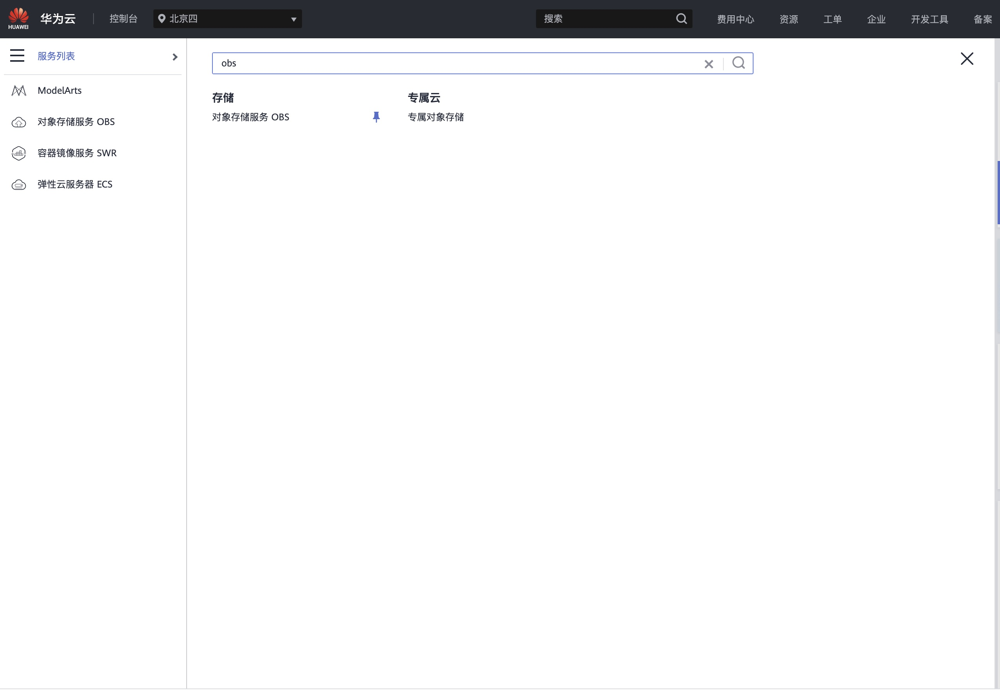
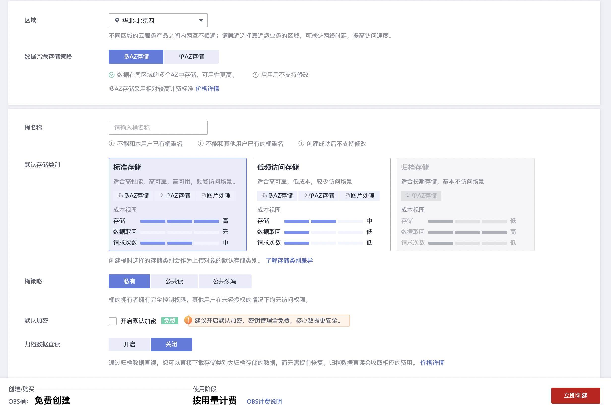

# HOW TO USE
### STEP 0
1. 目前使用华为云需要实名认证
2. 数据存储有开销，100G数据一个月存储费用大概为1.7元
3. 使用了一些技巧规避了免费V100GPU(32GB gpu-RAM)只能训练一小时的问题
### STEP 1 注册华为云账号 [注册链接](https://activity.huaweicloud.com/)
### STEP 2 创建 OBS 

1. 注意左上角区域选择 **北京四**， 点击 **对象存储服务obs**  
   
  
点击右上角 **创建桶**
 
 
**注意**: 这里桶的名字非常重要，后面会用到  

点击新创建的obs, 进入管理页面，左上角点击对象
  
这里相当于是一个云盘空间，方便后续加载数据集, 我们首先需要创建一个叫做free_train的文件夹，然后点击进入文件夹，再在下面创建四个文件夹，名称分别为\
**./code/**, **./data/**, **./log/**, **./out/**
结果如图所示
  

这里简单说明一下，code 是之后存放代码的目录， data是存放数据集的目录， log为输出日志的目录， out为模型输出结果的目录
   
### STEP 3 获取凭证
1. 这里一共需要三个凭证 分别为 **AK**，**SK** ，**PROJECT_ID**
2.其中 AK 和SK的 获取 方式如下图  
       
点击右上角自己的名字后，里面有一个我的凭证,按图中顺序创建即可
3. PROJECT_ID 在左边栏目的 API 凭证中

   
### STEP 4 使用华为云上的 model arts 开启免费训练
1. 首先找到 modelarts, 如下图

   
2. 第一次点击可能会需要授权服务，这里直接点授权就行，然后在左边栏目找到训练管理，点击下面的第一个训练作业，一会儿我们需要在这里查看训练任务是否正常运行了

   
3. modelarts 训练的整体流程如下图

   
## 其中大部分工作都已经在这个仓库里集成了，那么还需要你做一些事情。

1. 在 **./src/config.py** 中替换
```python

config.OBS_NAME = "你自己的obs名称"
config.CODE_UPLOAD_URL = "obs://你自己的obs名称/free_train/"
config.RUN_SCRIPT = "code/test.py" # 这里是你脚本启动文件的相对路径，从code下面开始
config.AK = "你自己的AK"
config.SK = "你自己的SK"
config.PROJECT_ID = "你自己的project_id"
```
2. 将你的代码放到 **/src/code**目录下，并在**config.py** 中修改启动脚本的文件位置
```python
config.RUN_SCRIPT = "code/test.py"
```
3. 稍微修改一下你的代码，包含 从obs中拷贝数据到你的训练环境虚拟机VM中，将生成结果从VM中拷贝到obs中,这里用到的moxing包是内置的，不需要安装
**注意**： copy_parallel 目前只支持文件夹，如果你需要单独拷贝文件，[参考这里](https://support.huaweicloud.com/moxing-devg-modelarts/modelarts_11_0005.html)
```python
# 这里有几个步骤
# 1. 在运行你的代码之前，首先加上数据拷贝的过程，这一步是从 obs -> train VM 
import moxing as mox
mox.file.copy_parallel('obs://your_bucket_name/free_train/data', '/cache/')
# 这样你就可以在你的训练vm中使用 /cache/data 访问你的数据目录了，亲测 240G 数据拷贝大概需要30S 左右
# 同理，在训练结束后将模型ckpt文件保存到你自己的obs中,这两句话的位置需要
mox.file.copy_parallel( '/cache/ckpt/', 'obs://your_bucket_name/free_train/data')


```

如果你使用了一些奇奇怪怪的包，也可以使用python调用命令行的形式安装你用到的包
```python
import os
os.system("pip install your_need_package")
```

每次训练开始前需要你加载一下之前训练的模型 check_point 方便继续训练，这么做是有原因的，另外，及其建议只读取一个ckpt文件，其为上一次训练的结果，且这个结果每次保存的名称相同
```python
# 首先 将你的模型ckpt文件夹拷贝到vm中，/cache下的空间大小为4T，是一块 超高速SSD
mox.file.copy_parallel('obs://your_bucket_name/free_train/ckpt', '/cache/')
# 这时候你的模型ckpt在 /cache/ckpt下

model.load("/cache/ckpt/last_epoch.ckpt")

# do train

model.save("/cache/ckpt/last_epoch.ckpt")
mox.file.copy_parallel('/cache/ckpt', 'obs://your_bucket_name/free_train/', )

```
只要你的代码保持这样的训练流程, 那么就可以完全正常的进行训练


4. 上传你的数据，可用使用 **upload_files.py** 这个文件，稍微修改一下你要上传文件的代码位置就可以了，在11行。默认上传到obs中的**free_train/data**下
```python
    upload2obs(session, "your data location", config.TRAIN.DATA_OBS_DIR)
```

5. 环境准备
```python
pip install requirements.txt
```
6. 运行你的代码，在这之前，算一算你需要设定多少iter参数
在**config.py**中有这么一行
```python
config.TRAIN.CONTINUE_ITERS = -1
```
存在的原因是这样的，由于一次只能使用一小时V100虚拟机，但是我们可用多次申请使用，于是我们可用测试一下一小时可完整训练多少epoch，例如n，然后使用上面的训练方法，创建CONTINUE_ITERS次训练任务
于是我们就可以得到 n * CONTINUE_ITERS 个epoch后的结果，这个流程几乎是自动的。只有**CONTINUE_ITERS** 设置为大于1 的整数才有用，设置为-1可用帮我们测试一小时可用跑多少epoch

在上述一切工作完成后，执行下面的命令，等待程序运行完成就ok了，另外建议在 ubuntu的 screen 模拟终端中执行命令防止被kill 
```python
python free_train.py >> out.txt
```


# 看到这里就木有了，下面会补充之后遇到的问题
1. create a obs in [huaweicloud.com](https://console.huaweicloud.com/)
2. create a dir name in **config.CODE_UPLOAD_URL**
3. creat a **log/** dir under **config.CODE_UPLOAD_URL**
4. create **out/** dir under **config.CODE_UPLOAD_URL**
5.. create **data/** dir under **config.CODE_UPLOAD_URL**

